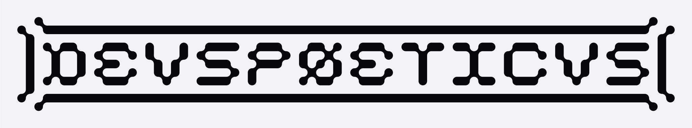

  <picture>
    
  </picture>
    
  <code>[ SYSTEM_READY ] // INIT: DEVSPØETICVS</code>

 

  

<h2>> STATS_</h3>

  
  

<h2 align="center">> TECHNICAL_STACK</h3>

<b>LANGUAGES_</b>

  
  
  
  
  

<b>FRAMEWORKS_ // _LIBRARIES</b>

  
  
  
  
  

<b>AI_TOOLKIT_</b>

  
  
  
  
  

<b>CREATIVE_SOFTWARE_</b>

  
  
  
  
  

<b>FIELDS_OF_INTEREST_</b>

  
  
  
  
  

<h2>> ARCHIVE // PROJECTS</h3>
<table width="100%">
  <thead>
    <tr>
      <th align="left" width="25%">TARGET</th>
      <th align="left" width="55%">PARAMETERS</th>
      <th align="left" width="20%">STACK</th>
    </tr>
  </thead>
  <tbody>
    <tr>
      <td><b>The Digital Exorcist</b></td>
      <td>Client-side aesthetic degradation and generative visual corruption.</td>
      <td><code>Wasm</code> <code>AI</code></td>
    </tr>
    <tr>
      <td><b>Audio Glitcher</b></td>
      <td>Low-level byte manipulation of video streams driven by audio frequencies.</td>
      <td><code>C</code> <code>FFmpeg</code></td>
    </tr>
    <tr>
      <td><b>Shader Data</b></td>
      <td>Isometric cities, rotating 3D cubes, glass-like toruses, and decay algorithms.</td>
      <td><code>GLSL</code> <code>p5.js</code></td>
    </tr>
    <tr>
      <td><b>Pixel Sorter</b></td>
      <td>High-performance image databending and pixel sorting application.</td>
      <td><code>Rust</code> <code>egui</code></td>
    </tr>
  </tbody>
</table>

 

  <code>END_OF_FILE // <a href="mailto:deuspoeticus@proton.me">INITIATE_CONTACT</a></code>
    
  <a href="https://instagram.com/deuspoeticus"><code>[ INSTAGRAM // @deuspoeticus ]</code></a>
  <a href="https://x.com/deuspoeticus"><code>[ X // @deuspoeticus ]</code></a>

